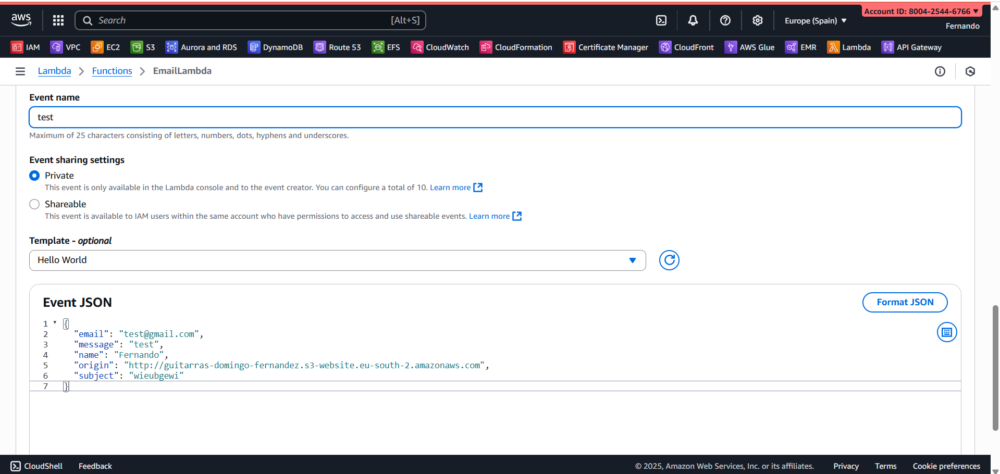

# guitarras-domingo-fernandez-web

This is a static webpage built with **React** and deployed entirely on **AWS**.

## Infrastructure provisioning.

This project can be both deployed in `aws` both using manual steps (ClickOps) or using IaaC provisioning (with `CloudFormation`)

### In order to manually deploy the project, follow the following steps:

1. Create a `CloudFront` distribution and add a `custom SSL certificate` to the `CloudFront` distribution (for example, an ACM certificate). Note that in `route 53` the assignation to the `CloudFront` distribution is also necessary: assign the record name with the `CloudFront` Distribution domain name (example: `d3ccausbv8iue6.cloudfront.net`) through Alias type (A type + Alias activated). It is also important that the `CloudFront` distribution has the `S3` website endpoint as origin and not the bucket itself.

2. Create a lambda function with node.js environment.

3. Lastly, create a type `HTTP` `API Gateway` with a POST endpoint `/contact` that consumes the email information and passes it onto the Lambda function. It is important to take into account that the Lambda service is, by default, asynchronous (i.e., while the message is being sent we can execute other tasks).

These three steps are fully automated using **CloudFormation** via the files `s3_bucket.yaml`, `cloudfront.yaml`, and `email_lambda_server.yaml`, eliminating the need for manual configuration and reducing the risk of human error.

## Continuous integration

New versions of this project can be deployed using `AWS CLI`. To deploy new versions into `AWS`, use `aws s3 sync build s3://guitarras-domingo-fernandez`.

In order to avoid network caching on the browser, activate option "Disable cache" in Network tab.

To automate deployment with `CloudFront`, use `./scripts/deploy.sh "BUCKET_NAME" "DISTRIBUTION_ID"` (it works with `AWS CLI` version `aws-cli/2.28.21 Python/3.13.7 Windows/11 exe/AMD64`).

Note that the lambda function from the `email_lambda_server.yaml` file is not created with correct code. The correct code must be updated afterwards.

In order to update the lambda function's code, we must upload a .zip file into AWS with the following content: `index.mjs`, `package.json`, `package-lock.json` (these 3 files can be found in `/lambda` folder) and `node_modules` installed (to obtain that, just execute `npm install --ignore-scripts` inside the `lambda` folder). Finally, set up the environment variables in lambda `Configuration > Environment Variables`.


## General information

This app was created using:

```bash
npx create-react-app my-app
cd my-app
npm start
```

`src` folder contains the application. The static files can be obtained executing

```bash
npm run build
```

Then, synchronize the static files generated in `/build` folder with `AWS` bucket using `aws s3 sync build s3://guitarras-domingo-fernandez`.

The `lambda` folder contains the script executed by the `AWS` Lambda function. `src/index.html` is the entrypoint of the website.

`public/error.html` displays an error page when the `S3` bucket fails to load (i.e., when the issue is on `AWS`'s side). In the case of a React app, the error document must be set to `index.html`, since React is a single-page application (SPA) that handles routing client-side, and any unknown path requested directly from the server should still load the same HTML file so that React's router can render the correct view.

`src/locales` folder contains the translations to 2 languages (Spanish and English).


## Troubleshooting `CloudFront` distribution `ERR_SSL_VERSION_OR_CIPHER_MISMATCH` error

Sometimes, CloudFront distribution can fail to load the SSL certificate. It can be troubleshooted using:

```bash
# Generic test
openssl s_client -connect guitarras-domingo-fernandez.es:443 -servername guitarras-domingo-fernandez.es
# Force TLS 1.2
openssl s_client -connect guitarras-domingo-fernandez.es:443 -servername guitarras-domingo-fernandez.es -tls1_2
# Force TLS 1.3
openssl s_client -connect guitarras-domingo-fernandez.es:443 -servername guitarras-domingo-fernandez.es -tls1_3
```

Then, the problem may be solved ensuring that the domain is in the `Alternate Domain Name` field in the CloudFront distribution.


## Troubleshooting email errors

Email error can be produced on the side of the `lambda` or on the side of the `API Gateway`. `lambda/lambda_test.json` contains a call to test the lambda function behaviour in the Lambda dashboard, like this:



`lambda/test_curl.sh` contains a test cURL call to test the API Gateway (remember to change the API URL) with correct parameters.